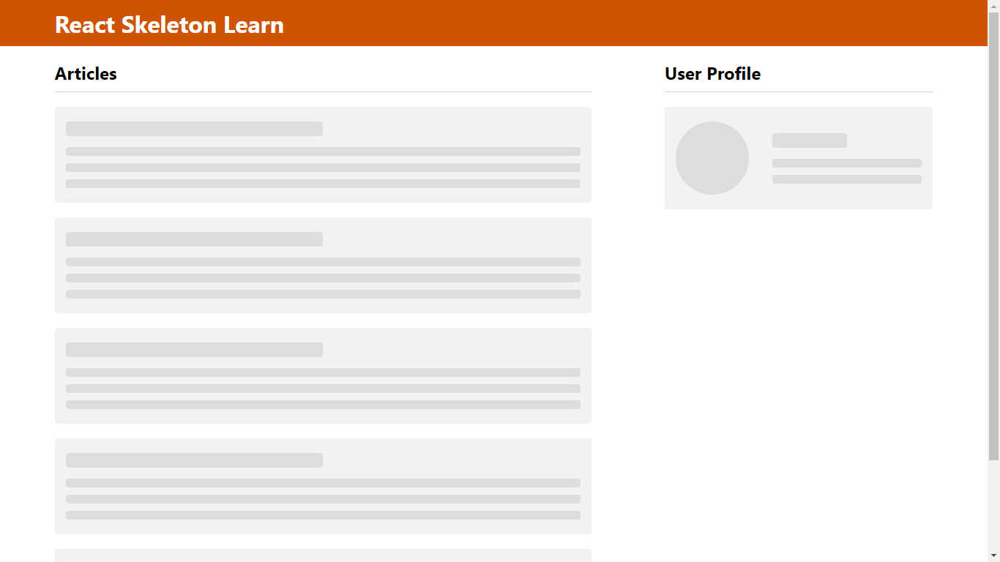
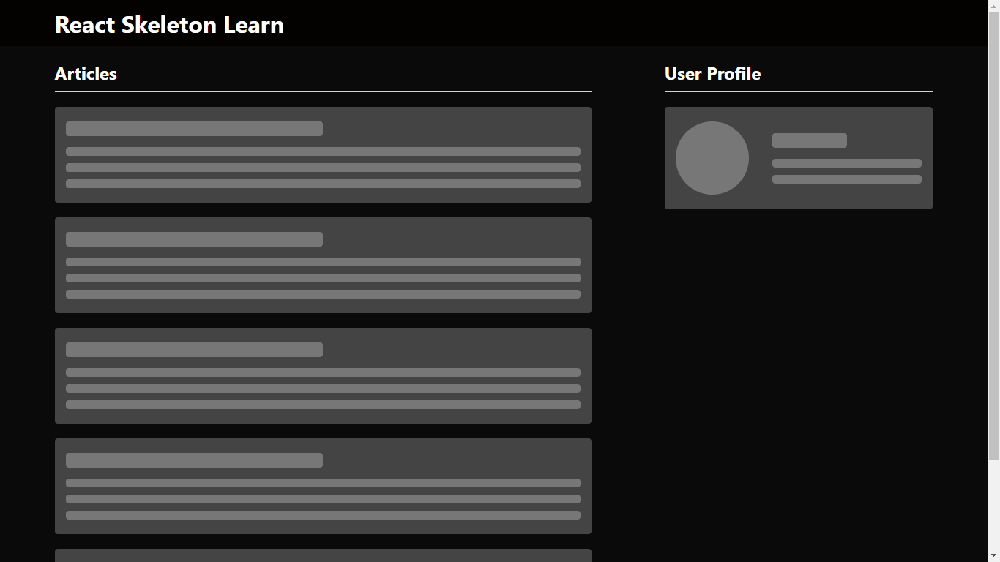

# React Loading Skeleton

**Loading skeleton like Facebook and YouTube while loading Posts or Videos.**

## Use :

Pass props dark or light default set to light.

```
<SkeletonArticle  theme="dark" />

<SkeletonProfile theme="dark" />
```

## Light Mode:



## Dark Mode:


